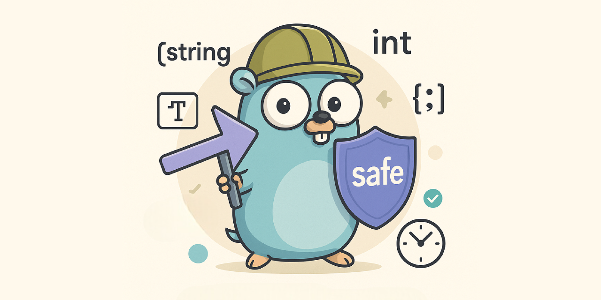

# safe

A minimalist Go package for safely working with pointers.

- 🛡️ Prevents nil panics
- ⚡ Zero-dependency, idiomatic, generic



---

## Overview

The `safe` package helps you extract values from pointers in a clean, generic, and safe way—avoiding repetitive `if != nil` checks 🕵.

* `Value`: Returns the value from a pointer, or the zero value.
* `ValueOr`: Returns the value from a pointer, or a default fallback.
* `Pointer`: Ensures a non-nil pointer, using zero value if needed.
* `PointerOr`: Ensures a non-nil pointer, using a default fallback.

---

## Installation

Using `Go 1.18+`

```bash
go get github.com/zakaria-chahboun/go-safe/safe@latest
```

## Usage (Value & ValueOr)

```go
package main

import (
	"fmt"
	"time"

	"github.com/zakaria-chahboun/go-safe/safe"
)

type User struct {
	Name *string
	Age  *int
}

func main() {
	// string
	var name *string
	fmt.Println(safe.Value(name)) // ""
	fmt.Println(safe.ValueOr(name, "Guest")) // Guest

	s := "Zakaria"
	name = &s                                    // 👈 not nil pointer
	fmt.Println(safe.Value(name))                // Zakaria
	fmt.Println(safe.ValueOr(name, "Anonymous")) // Zakaria ✅

	// int
	var age *int
	fmt.Println(safe.Value(age))       // 0
	fmt.Println(safe.ValueOr(age, 25)) // 25

	// struct
	type Info struct {
		City string
	}
	var info *Info
	fmt.Println(safe.Value(info))                       // {}
	fmt.Println(safe.ValueOr(info, Info{City: "Agadir"})) // {Agadir}

	// slice
	var items *[]string
	fmt.Println(safe.Value(items)) // []

	// map
	var data *map[string]int
	fmt.Println(safe.Value(data)) // map[]

	// time
	var created *time.Time
	fmt.Println(safe.Value(created)) // 0001-01-01 00:00:00 +0000 UTC

	now := time.Now()
	fmt.Println(safe.Value(&now)) // current time
}
```

## Usage (Pointer & PointerOr)

```go
package main

import (
	"fmt"
	"github.com/zakaria-chahboun/go-safe/safe"
)

func main() {
	// Case 1: Same pointer reuse
	var p1 *string
	fmt.Println("p1 before:", p1) // nil

	p1 = safe.PointerOr(p1, "default") // p1 gets a new address
	p2 := safe.Pointer(p1)              // p1 is not nil, so p2 points to the same address

	fmt.Println(*p1)      // default
	fmt.Println(*p2)      // default
	fmt.Println(p1 == p2) // true ✅ identical pointers


	// Case 2: Different allocations
	var ptr *int
	fmt.Println("ptr before:", ptr) // nil

	a := safe.Pointer(ptr) // new pointer allocated with zero value
	b := safe.Pointer(ptr) // another new pointer allocated with zero value

	fmt.Println(*a)     // 0
	fmt.Println(*b)     // 0
	fmt.Println(a == b) // false ❌ different memory addresses
}
```

### Note on Pointer Behavior

* If input pointer is **non-nil**, `Pointer`/`PointerOr` return it directly ✔
* If input pointer is **nil**, a **new pointer** is allocated:

  * `Pointer` → zero value
  * `PointerOr` → provided default value
* This means:

  * Two calls with the same non-nil pointer → same memory (`== true`)
  * Two calls with nil pointer → new memory each time (`== false`)

---

## Testing

Test coverage includes:

- Strings, ints, slices, maps, structs
- Time types
- Default vs. zero behavior
- Pointer identity

Run tests with:

```shell
go test ./safe -v -cover
```

---

## 📄 License

MIT — feel free to use and contribute.
