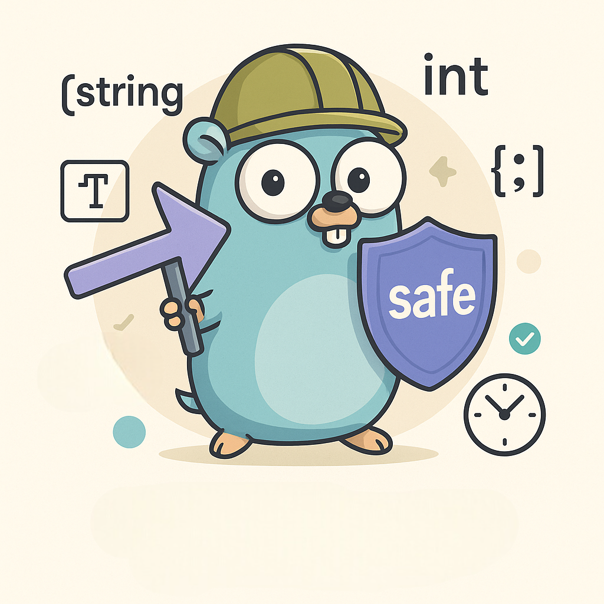

# safe

A minimalist Go package for safely working with pointers.

- 🛡️ Prevents nil panics
- ⚡ Zero-dependency, idiomatic, generic



---

## Overview

The `safe` package helps you extract values from pointers in a clean, generic, and safe way—avoiding repetitive `if != nil` checks.

- `Value`: Returns the value from a pointer, or a fallback (default or zero value).
- `Pointer`: Always returns a non-nil pointer, optionally using a default.

No more verbose lines:

```go
type Collection struct {
	Name *string // nil pointer
}

func main() {
	var collection *Collection // nil pointer
	var name string

    // ------------------------------------------

	// Verbose style
	if collection != nil && collection.Name != nil {
		name = *collection.Name
	} else {
		name = "default"
	}
	fmt.Println("Verbose:", name)

    // ------------------------------------------

	// Safe style
	coll := safe.Value(collection) // zero value: Collection{}
	name = safe.Value(coll.Name, "default") // default value
	fmt.Println("Safe:", name)
}
```

---

## Installation

Using `Go 1.18+`

```bash
go get github.com/zakaria-chahboun/go-safe/safe@latest
```

## Usage (Value)

```go
package main

import (
	"fmt"
	"time"

	"github.com/zakaria-chahboun/go-safe/safe"
)

type User struct {
	Name *string
	Age  *int
}

func main() {
	// string
	var name *string
	fmt.Println(safe.Value(name, "Guest")) // Guest

	s := "Zakaria"
	name = &s
	fmt.Println(safe.Value(name)) // Zakaria

	// int
	var age *int
	fmt.Println(safe.Value(age))       // 0
	fmt.Println(safe.Value(age, 25))   // 25

	// struct
	type Info struct {
		City string
	}
	var info *Info
	fmt.Println(safe.Value(info))                       // {} (zero)
	fmt.Println(safe.Value(info, Info{City: "Agadir"})) // {Agadir}

	// slice
	var items *[]string
	fmt.Println(safe.Value(items)) // []

	// map
	var data *map[string]int
	fmt.Println(safe.Value(data)) // map[]

	// time
	var created *time.Time
	fmt.Println(safe.Value(created)) // 0001-01-01 00:00:00 +0000 UTC

	now := time.Now()
	fmt.Println(safe.Value(&now)) // current time	
}
```

## Usage (Pointer)

```go
package main

import (
	"fmt"
	"github.com/zakaria-chahboun/go-safe/safe"
)

func main() {
	// ------------------------------------
	// Case 1: Same pointer reuse
	// ------------------------------------
	var p *string
	fmt.Println("p before:", p) // nil

	p = safe.Pointer(p, "default") // p gets a new address since it was nil
	p2 := safe.Pointer(p)          // p is not nil, so p2 points to the same address

	fmt.Println("p value:", *p)    // p value: default
	fmt.Println("p2 value:", *p2)  // p2 value: default
	fmt.Println("p == p2:", p == p2) // true ✅ identical pointers

	// ------------------------------------
	// Case 2: Different allocations
	// ------------------------------------
	var ptr *int
	fmt.Println("ptr before:", ptr) // nil

	a := safe.Pointer(ptr) // new pointer allocated with zero value
	b := safe.Pointer(ptr) // another new pointer allocated with zero value

	fmt.Println("a value:", *a)     // 0
	fmt.Println("b value:", *b)     // 0
	fmt.Println("a == b:", a == b)  // false ❌ different memory addresses
}
```

### Note on Pointer Behavior

- When the input pointer is nil, safe.Pointer allocates and returns a new pointer holding the zero or default value.
- If the input pointer is not nil, safe.Pointer simply returns it as-is — no new memory is allocated.
- This means:
    - Two calls with the same non-nil pointer will return identical pointers (`== true`).
    - Two calls with a nil pointer will return different pointers, even if the values are equal (`== false`).

## Testing

Test coverage includes:

- Strings, ints, slices, maps, structs
- Time types
- Default vs. zero behavior
- Pointer identity

Run tests with:

```shell
go test ./safe -v -cover
```

## 📄 License

MIT — feel free to use and contribute.